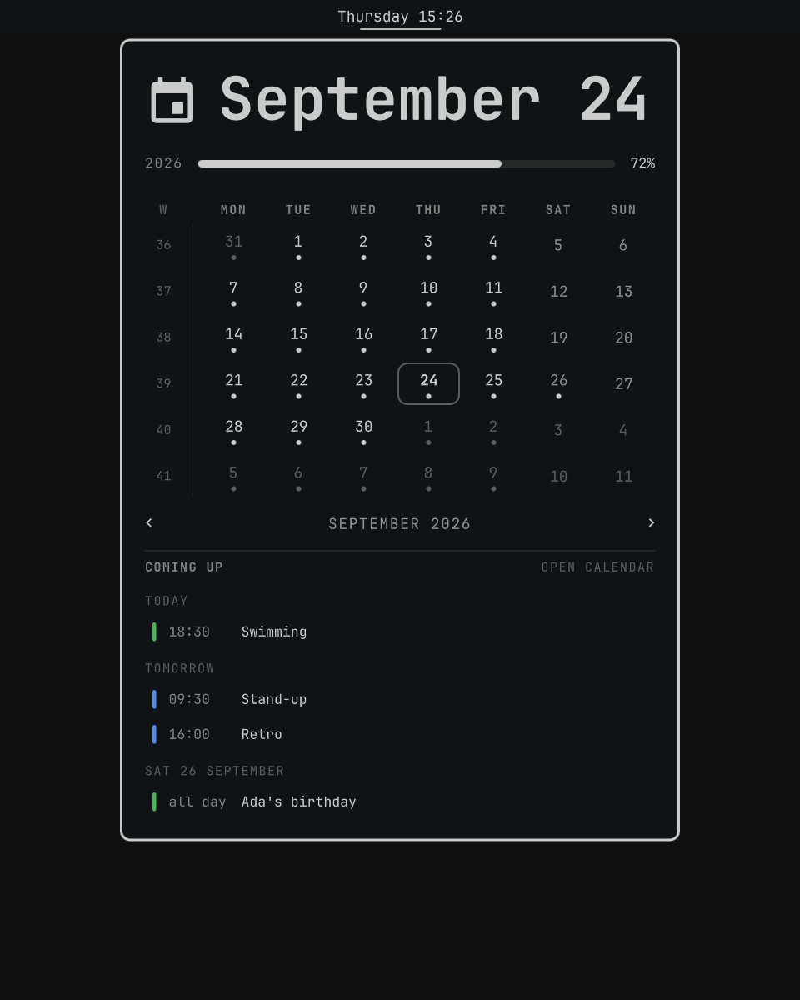
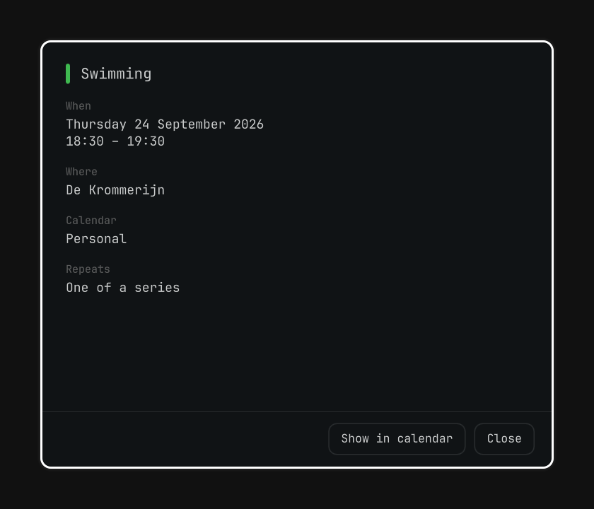

# Olook Calendar

A clock-and-calendar bar widget for [Omarchy](https://omarchy.org/) that stands
in for Omarchy's own clock. The bar shows the date and time; the popup is laid
out like the clock's — the date, the year's progress, a month with ISO week
numbers — with the days you have something on marked, the coming week listed
underneath, and a notification before each appointment starts.

It reads your calendars through [Olook](https://github.com/TiniTinyTerminator/Olook),
so it shows whatever Olook has: Google, Microsoft, any CalDAV server, and
`.ics` files or links. Clicking an appointment opens it in a window of its own.

<p>
  
  
</p>

The screenshots are demo data.

## Install

Olook first, then this:

```bash
omarchy plugin add https://github.com/TiniTinyTerminator/Olook.git --enable
omarchy plugin add https://github.com/TiniTinyTerminator/Olook-calendar.git
```

To have it take the clock's place:

```bash
omarchy bar put ttt.olook-calendar --before omarchy.clock
omarchy plugin disable omarchy.clock
```

Update with `omarchy plugin update ttt.olook-calendar`.

## Using it

| | |
|---|---|
| Click | Open the month |
| Right-click | Read the calendar again |
| Middle-click | Open Olook's calendar |
| `←` `→` / `[` `]` / scroll | Previous / next month |
| `↑` `↓` / `{` `}` | Previous / next year |
| `t` | Back to today |
| `o` | Open Olook's calendar |

Click a day to see just that day; click it again to go back to what is coming.

Its settings sit with the widget in Omarchy's bar settings: the label's
format, whether the next appointment shows in the bar too, how many days
ahead the list looks, how often it refreshes, and how many minutes before an
appointment the reminder comes — 0 turns reminders off.

## Licence

MIT
